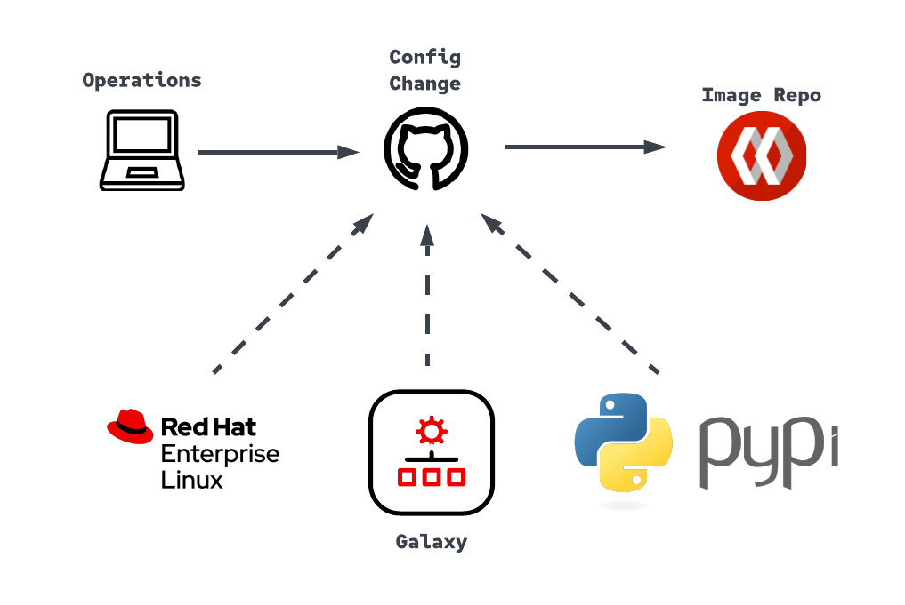

= Automated Execution-Environment Builder - Ansible Automation Platform 2

NOTE: *fork* or *clone* repo so that you can use your own GitHub Secrets and workflow.

== Content

* <<Purpose, Purpose>>
* <<Workflow, Workflow>>
* <<Prereqs, Prereqs>>
* <<Playbook, playbook>>
* <<Status, Status>>

== Purpose

This repo contains everything needed to create a closed loop automated way to create Execution Environments for Ansible Automation Platform.

== Workflow

A workflow will begin automaticaly when `fluff-builder.yml` has been updated and a PR has been merged to the `main` branch. 
* Launch ubuntu-latest runner
* Checkout main branch
* Install Python dependencies
** ansible-builder
** ansible-runner
* Install Ansible collections
** awx.awx
** link:https://github.com/redhat-cop/ee_utilities/tree/devel/roles/ee_builder[infra.ee_utilities]
* Runs `fluffy-builder.yml` with *EE_REGISTRY_PASSWORD* and *AH_TOKEN* GitHub Secrets being passed in as Extra Vars

This will create an image and push to remote image registry, ie. DockerHub, Quay,  or Private Automation Hub

The steps below describe what to update in the `fluffy-builder.yml` in order to successfuly create an execution environment.

.Prerequisites
* Update https://github.com/r3dact3d/fluffy-ee/settings/secrets/actions[GitHub Secrets]
** AH_TOKEN - Galaxy or Automation Hub API Key (needs to provide creds for `ee_ah_host`)
** EE_REGISTRY_PASSWORD - DockerHub or Image Registry Password (needs to provide creds for `ee_registry_dest`)

NOTE: These secrets get passed during the GitHub Actions workflow.
  This method is easy for demo but maynot meet production requirements link:https://github.com/r3dact3d/fluffy-ee/blob/main/.github/workflows/build-ee.yml#L29["Passing Secrets"]

.Example - Need to update if forked
. link:https://github.com/r3dact3d/fluffy-ee/blob/main/fluffy-builder.yml#L9["ee_registry_dest"] - Currently set to my personal link:https://hub.docker.com/repositories/r3dact3d["Docker Hub"]
. link:https://github.com/r3dact3d/fluffy-ee/blob/main/fluffy-builder.yml#L10["ee_registry_username"] - Update to reflect username for the `ee_registry_dest` value
. link:https://github.com/r3dact3d/fluffy-ee/blob/main/fluffy-builder.yml#L12["ee_ah_host"] - FQDN of Hub to get collections, I chose link:galaxy.ansible.com["Ansible Galaxy"] for ease of use

.Ansible Execution Environment Builder

image::https://github.com/r3dact3d/fluffy-ee/actions/workflows/build-ee.yml/badge.svg[link="https://github.com/r3dact3d/fluffy-ee/actions/workflows/build-ee.yml"]

