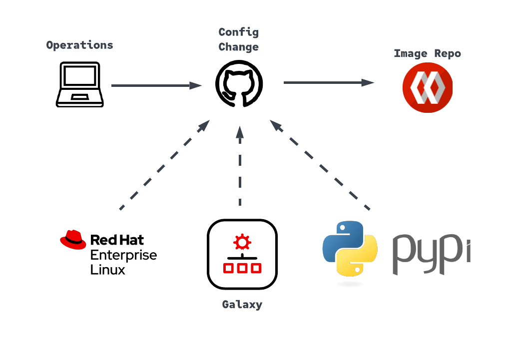

= Automated Execution-Environment Builder - Ansible Automation Platform 2

NOTE: Fork or clone this repository so you can use your own GitHub Secrets, Variables, and Environment settings.

== Contents

* <<Purpose, Purpose>>
* <<Workflow, Workflow>>
* <<Prereqs, Prereqs>>
* <<Playbook, Playbook>>
* <<Status, Status>>

[[Purpose]]
== Purpose

This repository automates building and publishing Ansible Execution Environment (EE) images with GitHub Actions and the `infra.ee_utilities.ee_builder` role.

== Workflow

This repository includes two build workflows:

* `ee-builder-dev.yml`
** Trigger: push to `dev` with changes to `ee_builder.yml`
** Supports manual runs through `workflow_dispatch`
* `ee-builder-test.yml`
** Trigger: push to `test` with changes to `ee_builder.yml`
** Supports manual runs through `workflow_dispatch`

.Workflow steps
* Launch `ubuntu-latest` runner
* Check out repository source
* Install Python dependencies from `requirements.txt` (`ansible-builder`)
* Install Ansible collections from `collections/requirements.yml`
** `awx.awx`
** `infra.ee_utilities`
** `infra.ah_configuration`
** `containers.podman`
** `community.general`
* Run `ansible-playbook ee_builder.yml` with environment-specific vars and secrets
* Build and push the EE image to the configured registry

[[Prereqs]]
== Prereqs

.GitHub Secrets
* Configure at https://github.com/r3dact3d/Ansible-Execution-Environment-Stream/settings/secrets/actions[GitHub Secrets]
** `AH_TOKEN` - Galaxy or Automation Hub API token
** `EE_REGISTRY_PASSWORD` - Password/token for destination image registry
** `EE_BASE_REGISTRY_PASSWORD` - Password/token for base registry (used in `dev` workflow)

.GitHub Variables and Environment Variables
* Configure at https://github.com/r3dact3d/Ansible-Execution-Environment-Stream/settings/environments[GitHub Environments]
** `EE_REGISTRY` - Destination image registry (for example, Docker Hub or Quay)
** `EE_REGISTRY_USERNAME` - Username for `EE_REGISTRY`
** `EE_BASE_REGISTRY_USERNAME` - Username for base image registry (used in `dev` workflow)

NOTE: Passing credentials directly as workflow extra vars is simple for demos, but you should evaluate stronger secret management patterns for production use.

[[Playbook]]
== Playbook

Main build definition: https://github.com/r3dact3d/Ansible-Execution-Environment-Stream/blob/aws_powershell/ee_builder.yml[`ee_builder.yml`]

Key sections to customize:

* `ee_list[].name` - output image name
* `ee_list[].base_image` - source EE/base image
* `ee_list[].dependencies` - Python, system, and collection dependencies
* `ee_list[].build_steps` - additional build-time image customization
* `ee_ah_host` and related Galaxy settings - collection source behavior

Registry destination and username are passed in from GitHub workflow variables (`EE_REGISTRY`, `EE_REGISTRY_USERNAME`) rather than being hardcoded in this playbook on `aws_powershell`.

[[Status]]
== Status

.Ansible Dev Image Builder
image::https://github.com/r3dact3d/Ansible-Execution-Environment-Stream/actions/workflows/ee-builder-dev.yml/badge.svg[link="https://github.com/r3dact3d/Ansible-Execution-Environment-Stream/actions/workflows/ee-builder-dev.yml"]

